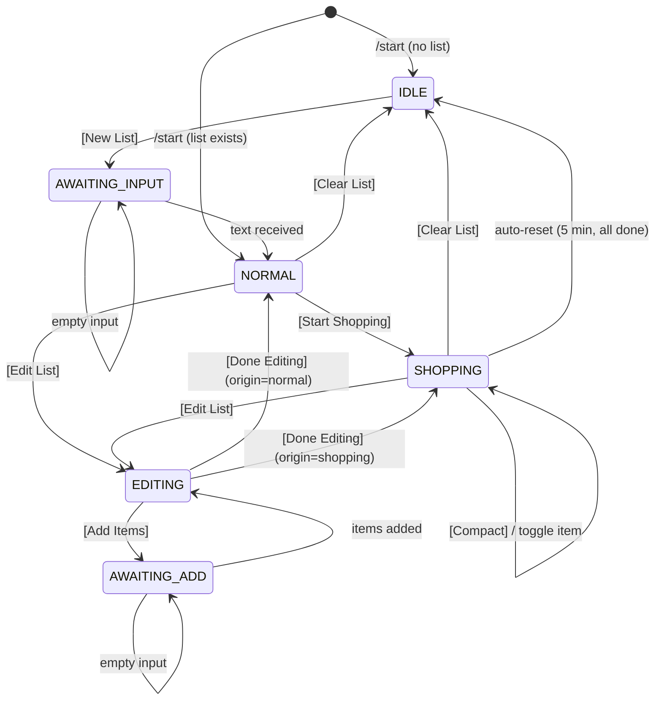

# State Machine & UI Reference

## Core Flow

1. User sends `/start` — bot creates persistent status message: "No active list" with [New List]
2. User taps [New List] — status edits to "Send me a comma-separated list..."
3. User sends `bread, milk, beer, eggs` — bot saves items, status edits to "Shopping List: 4 items" with [Start Shopping] [Clear List] [Edit List]
4. User taps [Start Shopping] — status becomes header "Shopping List (0/4 done)" with [Compact] [Clear List] [Edit List], bot sends one message per item with [Done] button
5. User taps [Done] on an item — item text gets strikethrough, button becomes [Undo], header counter updates
6. [Compact] hides completed items mid-shopping; when all items complete, sends confirmation + schedules 5-min auto-clear
7. [Clear List] soft-deletes all list data, removes item messages, resets status to IDLE
8. [Edit List] (from NORMAL or SHOPPING) — switches item keyboards to [Remove], status shows [Add Items] + [Done Editing]

## State Machine

## Status Message Content Per State

| State          | Text                                   | Buttons                                     |
|----------------|----------------------------------------|---------------------------------------------|
| IDLE           | "No active list."                      | [New List]                                  |
| AWAITING_INPUT | "Send me a comma-separated list..."    | (none)                                      |
| NORMAL         | "Shopping List: N items"               | [Start Shopping] [Clear List] / [Edit List] |
| SHOPPING       | "Shopping List (X/Y done)"             | [Compact] [Clear List] / [Edit List]        |
| EDITING        | "Editing List: N items"                | [Add Items] [Done Editing]                  |
| AWAITING_ADD   | "Send items to add (comma-separated)." | (none)                                      |

## Callback Data Format

| Pattern                 | Handler                    | Description                           |
|-------------------------|----------------------------|---------------------------------------|
| `action:new_list`       | `list.handleNewList`       | Transition IDLE -> AWAITING           |
| `action:start_shopping` | `shop.handleStartShopping` | Transition NORMAL -> SHOPPING         |
| `action:clear_list`     | `clear.handleClearList`    | Transition any -> IDLE                |
| `action:compact`        | `compact.handleCompact`    | Hide completed items in SHOPPING      |
| `action:edit_list`      | `edit.handleEditList`      | Transition NORMAL/SHOPPING -> EDITING |
| `action:done_editing`   | `edit.handleDoneEditing`   | Return to NORMAL or SHOPPING          |
| `action:add_items`      | `edit.handleAddItems`      | Transition EDITING -> AWAITING_ADD    |
| `toggle:<item_id>`      | `callback.handleToggle`    | Flip item complete/active             |
| `remove:<item_id>`      | `edit.handleRemoveItem`    | Soft-delete item, delete its message  |

## Future Iterations

- Natural language parsing (LLM-based) instead of comma-separated input
- Grouped items by shop area (single message with multiple buttons per group)
- Multiple concurrent lists
- Shared family group chat support
