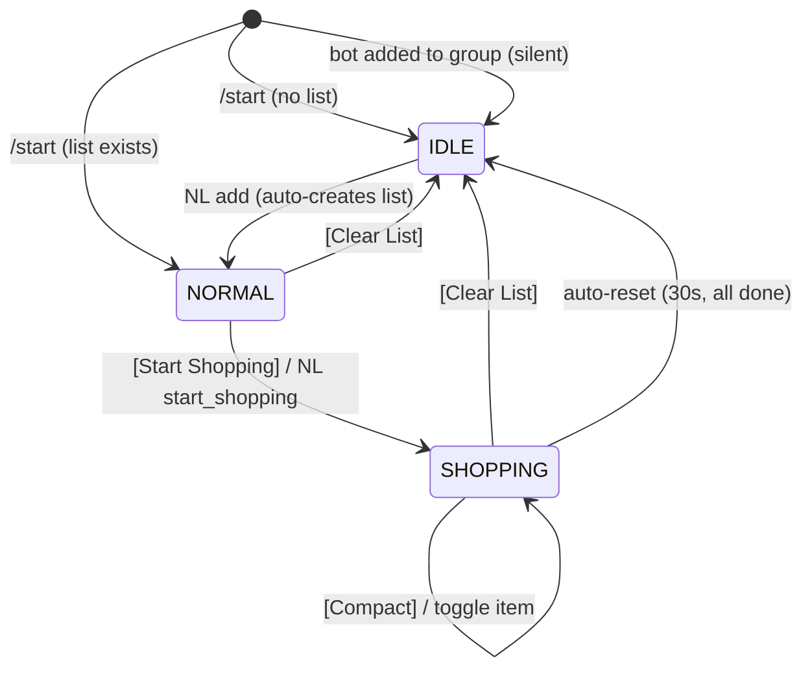

# State Machine & UI Reference

## Private Chat Flow

1. User opens private chat with the bot and sends `/start` — bot sends a persistent status message (IDLE or NORMAL depending on whether a list exists)
2. **Any text** typed in private is NL-classified automatically — no @mention needed
3. **Add items** (`добавь молоко`, bare list `молоко хлеб яйца`):
   - If IDLE: auto-creates a list and transitions to NORMAL
   - Otherwise: appends to existing list, skipping duplicates
   - User's message is **deleted** (status message is the only confirmation)
4. **Remove items** (`убери молоко`): removes matched items via LLM semantic match; status updated; user message deleted
5. **Show list** (`покажи список`): bot replies with a plain-text summary; status edited in place; user message kept
6. **Start shopping** (`начни покупки`, `поехали`): transitions to SHOPPING; user message deleted
7. User taps **[New List]** button — creates empty list immediately, status shows NORMAL
8. All other button interactions (toggle, compact, finish, clear) work as labeled

## Group Chat Flow

1. Bot is added to group — **completely silent**, no message sent
2. Bot ignores all messages unless directly addressed
3. To interact, members either:
   - Send `@botname <text>` (mention), or
   - Reply to the pinned status message with text
4. **First add command** (`@bot добавь молоко`):
   - Creates list, sends confirmation reply anchored to user's message
   - Sends a new status message at the **bottom of the chat** and **pins it silently** (no notification)
5. **Subsequent @mention or reply-to-status commands**:
   - Bot first **unpins and deletes** the old status message (wherever it is in history)
   - Sends the updated status message at the **bottom** and **pins it** again
   - This ensures the pinned message is always current and at the bottom
6. **Show list** (`@bot покажи список`): unpin+delete old → send new status at bottom → pin
7. **Start shopping** (`@bot начни покупки`): sends `🛒 Поехали!` reply, then re-sends+re-pins shopping status
8. **Unknown intent**: bot replies with a context-aware hint; no status change
9. **Button presses** on the pinned status: edits in place (no re-send/re-pin) — only NL interactions re-pin
10. User messages in group are **never deleted** by the bot
11. `/start` in group: explicitly sends and pins a fresh status message (works same as subsequent interactions)

## State Machine

## Status Message Lifecycle Per Chat Type

| Action | Private chat | Group chat |
|--------|-------------|------------|
| `/start` | Send + update DB | Send + pin + update DB |
| Button press | Edit in place | Edit in place (no re-pin) |
| NL add (first, IDLE→NORMAL) | Edit in place | Confirmation reply + send new at bottom → pin |
| NL add (subsequent) | Edit in place | Confirmation reply + edit pinned in place (no re-pin) |
| NL show | Reply with text + edit in place | Unpin old → delete old → send new at bottom → pin |
| NL start_shopping | Edit in place | Unpin old → delete old → send new at bottom → pin |
| NL unknown | Reply only, no status change | Reply only, no status change |
| [Clear List] | Edit in place to IDLE | Unpin + delete status entirely (no IDLE shown) |

## Status Message Content Per State

| State    | Text                          | Buttons                                    |
|----------|-------------------------------|--------------------------------------------|
| IDLE     | "Список покупок пуст."        | [New List]                                 |
| NORMAL   | Items grouped by department   | [Start Shopping] [Clear List]              |
| SHOPPING | "Покупки (X/Y куплено)"       | [Compact] [Finish]                         |

## Natural Language Commands

Both **@mention** and **reply-to-status-message** in groups, and **any text** in private chat, trigger the same NL pipeline:

| Example phrase (Russian)                | Intent detected   | Action                                      |
|-----------------------------------------|-------------------|---------------------------------------------|
| добавь молоко и хлеб                    | `add`             | Adds items; creates list if IDLE            |
| молоко, хлеб, яйца                      | `add`             | Bare list treated as "add"                  |
| добавь картошки 1кг                     | `add`             | code="картошка", details="1кг"             |
| убери молоко                            | `remove`          | Resolves match via LLM, removes item(s)     |
| вычеркни вино                           | `remove`          | Removes all wine items (белое + красное)    |
| покажи список                           | `show`            | Replies with plain-text summary             |
| что в списке?                           | `show`            | Same as above                               |
| начни покупки                           | `start_shopping`  | Switches to SHOPPING mode                   |
| поехали                                 | `start_shopping`  | Same                                        |
| anything else                           | `unknown`         | Context-aware hint reply                    |

**Private chat:** user message deleted after `add`, `remove`, and `start_shopping`; kept for `show` and `unknown`.
**Group chat:** user messages never deleted; confirmation reply anchored to user's message.

## Callback Data Format

| Pattern                 | Handler                       | Description                           |
|-------------------------|-------------------------------|---------------------------------------|
| `action:start_shopping` | `shop.handleStartShopping`    | Transition NORMAL → SHOPPING          |
| `action:clear_list`     | `clear.handleClearList`       | Transition any → IDLE                 |
| `action:compact`        | `compact.handleCompact`       | Hide completed items in SHOPPING      |
| `action:finish_shopping`| `shop.handleFinishShopping`   | Finish shopping → NORMAL              |
| `toggle:<item_id>`      | `callback.handleToggle`       | Flip item complete/active             |
